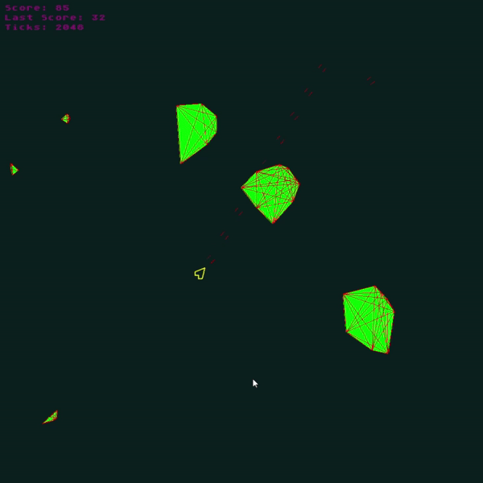

# Asteroids 

### Container Setup (windows):
- Prerequisites:
    - Docker Desktop 🐳
    - X11 forwarding:
        - download install vcxsrv
        - download install Xming X Server for Windows
        - run xlaunch.exe and select: 
            - "Multiple windows"
            - "Start no client"
            - "Disable access control" (this is important to allow connections from Docker)

- `./run_windows.bat`

### Or run directly:
- Install dependencies in requirements.txt
- `$ cd src`
- `$ python main.py`